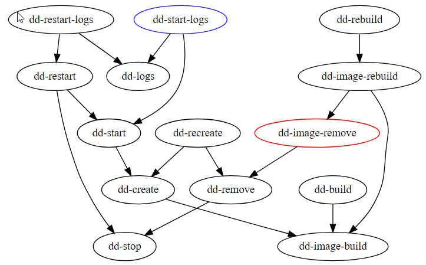

# Docker utils

This is a set of utilities focused on the main scenarios when developing with docker:

- start (and build image, create container, start container, log everything alongside)
  `dd-start-logs`

- remove image (and stop container, destroy container, remove image to recreate it from scratch)
  `dd-image-remove`
- there is a set of dependencies between them 
  
- info
  ```bash
  $ dd-info
  +=======================================+
  | Entering project DOCKUTILS.GIT at /home/vagrant/data/work2/dockutils.git ...
  |
  | NAME       = my-hello-world
  | VERSION    = 0.3
  | IMAGE      = mylocal/my-hello-world:0.3
  | HOST       = <none> - optional for build-only components
  | REPOSITORY = mylocal/
  | NETWORK_NAME = <missing>
  |
  | PORTS
  |   EXTERNAL_HTTP_PORT=8080
  |   HTTP_PORT=8080
  | DESCRIPTION
  |
  |   A demo of dockerutils.
  |
  | DIR=/home/vagrant/data/work2/dockutils.git
  | BASEDIR=/home/vagrant/data/work2/dockutils.git
  | TARGET=
  |
  |------------------------------------------------
  | For pull/push to external repository
  |
  | EXTERNAL_REPOSITORY = registry.gitlab.com/raisercostin/docker2/
  | EXTERNAL_IMAGE      = registry.gitlab.com/raisercostin/docker2/my-hello-world:0.3
  |------------------------------------------------
  | Available commands:
  |   dd-attention-clean
  |   dd-attention-clean-system
  |   dd-build
  |   dd-clean-orphan
  |   dd-create
  |   dd-export-to-file
  |   dd-export-to-repository
  |   dd-image-build
  |   dd-image-rebuild
  |   dd-image-release-in-progress
  |   dd-image-remove
  |   dd-import-from-file
  |   dd-import-from-repository
  |   dd-info
  |   dd-logs
  |   dd-rebuild
  |   dd-recreate
  |   dd-remove
  |   dd-restart
  |   dd-restart-logs
  |   dd-run
  |   dd-shell
  |   dd-shell-root
  |   dd-simple-create
  |   dd-start
  |   dd-start-logs
  |   dd-stop
  |   dd-tree
  +=======================================+
  ```
